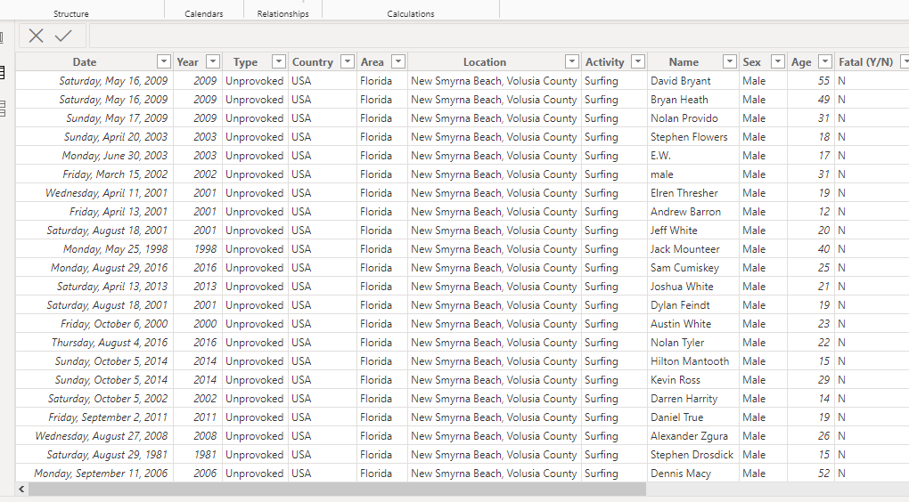
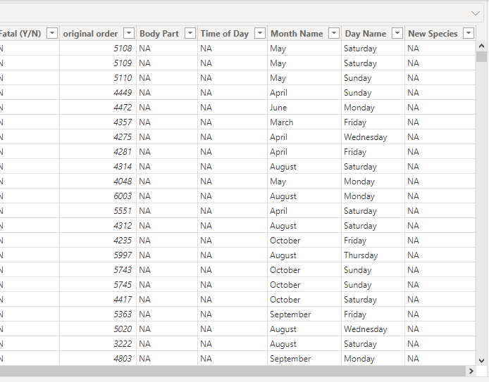
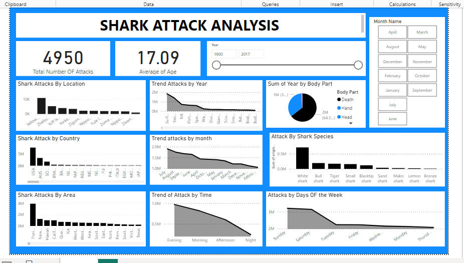

# Shark-Attack-Analysis

## Introduction
This is a shark data analysis show how shark attacks human being over a period of time. This data visualized using Power BI is used to make data driven decisions.

_Disclaimer_ _All data sets and reports do not represent any company, institution or country, but just a dummy data set to demostrate the capabilities of Power Bi_
___

____

## Problem Statement
1.  Shark attack by location
2.  Trend attack by year
3.  Attack by body part
4.  Attack by country
5.  Trend analyis by month and time of the day
6.  Attack by species
7.  Attack by area and days of the week.

____

## Skills/Concept Demostrated:
- Bookmarking
- Conditional Column
- Creation of Time of the day Column i.e morning, afteroon, evening and night
- Creation of day of the week column i,e Monday - Sunday
- Creation of part of the body attacked column i.e head, hand, leg, death
- Creation of types of shark species attacking people e.g white shark, bull shark, tiger shark etc
- Modelling
- Filters
- Button

____

##Table view 1                                 | ##Table view 2
:---------------------------------------------:  :---------------------------------------:
                                

## VISUALIZATION Generated

___

Conclusion and Recommendation
Human Activity Influence: Many shark attacks occur in areas where humans engage in water activities, suggesting a correlation between human presence and incident rates.

Species Specificity: Certain shark species are more frequently involved in attacks, such as great whites and bull sharks, likely due to their size, habitat, and feeding patterns.

Geographical Variability: Attack frequencies vary by region, influenced by factors like water temperature, prey availability, and proximity to migration routes.

Risk Mitigation: Strategies like beach closures, shark nets, and public education programs play crucial roles in mitigating risks and increasing public safety.

Media Influence: The portrayal of shark attacks in media can sometimes exaggerate the actual risk, leading to misconceptions about the true frequency and danger posed by sharks.

Thank you.
